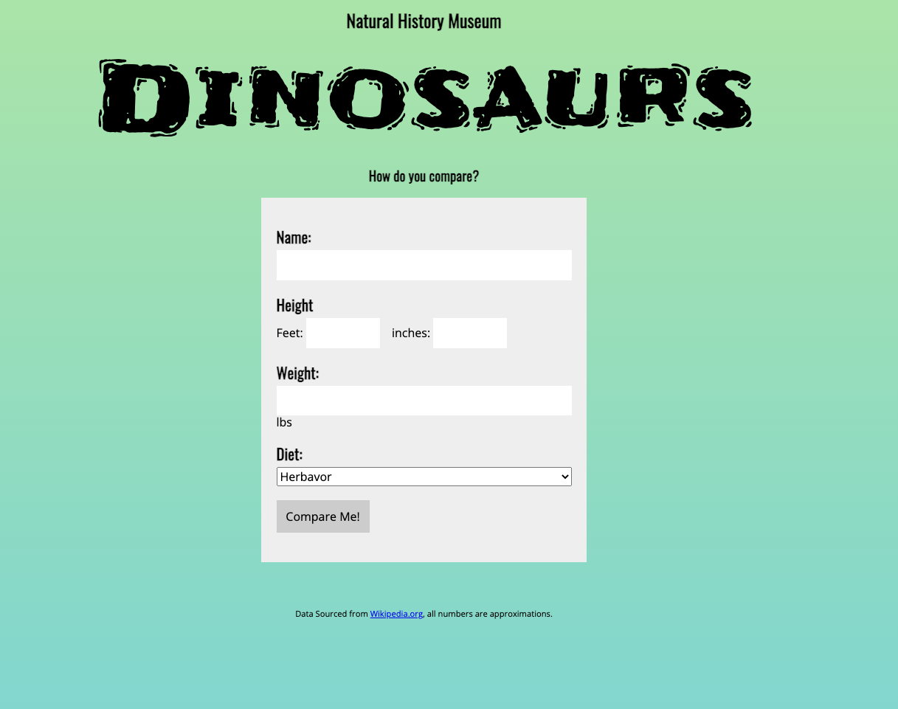
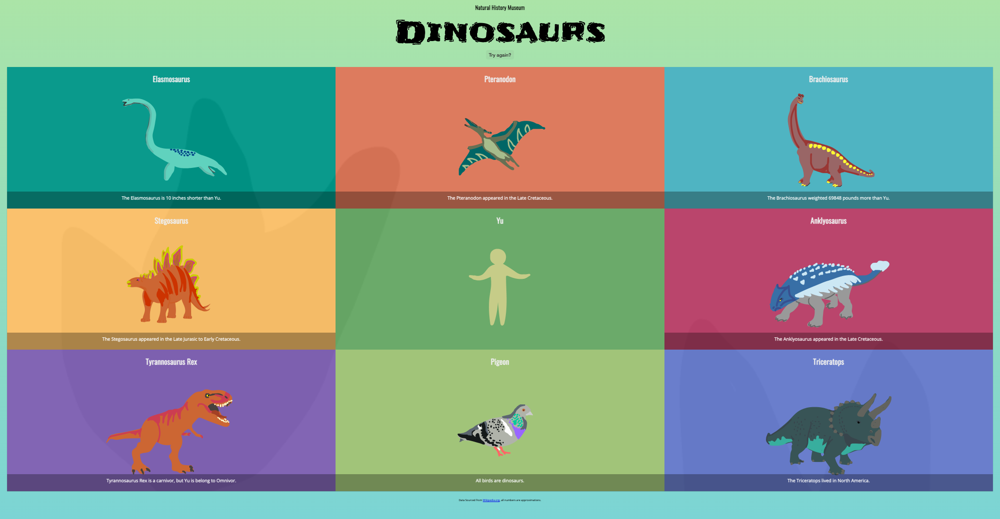

# Project: Dinosaurs

## How to run
Open the index.html in your browser
Click the 'compare-me' button to make a comparison between a human and a dinosaur

## Development Strategy
1. Clone the starter package from the GitHub repository. Go through the files to review the contents and familiarize yourself with the pieces that have been supplied. Pay specific attention to what the index.html file already contains and what seems to be missing. No server, task runner, or bundler is required for this project, but if you feel it improves your personal workflow, now would be the time to add them. The ES6 techniques that have been introduced are encouraged, but if you are not using a build tool, there will be no transpiling to ES5; this will not be counted against you for this assignment, but will be worth considering if you choose to display it for your portfolio.
2. Decide how you will work with classes, then build out your classes and objects.
   - There are several ways to build your objects, as well as multiple design patterns. What will be the most readable for this project?
   - Do you have a need for subclasses?
   - What properties are needed?
3. Get human data from the html form to build your human object. Think about what 3 things you are going to compare to your human. You may need to create more fields, adjust the fields that are there, or remove fields to correspond with the data you will be collecting.
   - Do you need to create any functions to translate the data values to values that can be compared to the dino data.
   - How do the properties compare? Do you need any additional ones?
   - Start thinking about what events are going to need to occur and how you can take advantage of IIFEs.
4. Create at least 3 methods that compare dino data to human data. Depending on how you decided to create your objects and what design pattern you chose, you may encounter issues accessing or working with some of the data. Do you need to create any functions to access/store this data?
   - When was the last time you linted your code? The linter may suggest you move around some of your methods and objects and name functions properly.
   - What sort of conversions are needed for your methods to get accurate output? It’s easiest to use console.log here for testing, but start thinking about how you are going to get this data onto the DOM.
5. Generate tiles and append to the DOM. Each Dino title must include at least the species, an image, and a fact. The dino fact displayed should be chosen at random from at least 6 options (including your 3 methods). The Human tile must include the user’s name, and the human graphic--no fact is needed. The bird tile should include the species, image, and fact, “All birds are dinosaurs.”
   - How will you display different information on the tiles dependant on dino, bird, or human?
   - How will you randomize the fact that is being displayed? If needed, here is a hint.
   - How can you create the html for these tiles and get them to display on the dom? There are a lot of options for this some faster, some more secure. Time and experience will help you choose the best option for future projects.
6. Make certain the grid is not being added until you click the button to submit user data. Additionally, remove the form once the user has clicked to generate the infographic. It is a good idea to remove any calls to console.log at this point.
7. REFACTOR. At this point, your code should be working properly. Ideally, refactoring happens while you are developing, but as a new developer, you often don’t have the whole picture in your head to be able to do so properly. Let’s clean the project up.
   - Have you run your code through a linter? We request you still follow Udacity standards when the code is complete, but running it through an eslinter is going to help you get started in refactoring.
   - Are you using ES6 const and let?
   - Are you taking advantage of ES6 arrow functions and naming them appropriately?
   - Is your code DRY? Are there any pieces that would be better served as a helper function to avoid duplication?
   - How is your code structured? Have you created functions for the main functionality with properly scoped variables? Remember the design patterns you learned for Object Oriented Javascript, would readability improve if you followed those patterns?
   - Are you using the best method for your iterations?
8. Suggested: Validate the form data to ensure the data is acceptable and complete. Allow the user to generate a new infographic. Move the tile colors from CSS to JS for more control. Randomize the order of the tiles while keeping the human in the middle. Create a hover state on the tiles that displays the rest of the species statistics. Create additional methods for comparing data. Rewrite the project to use constructor functions, factory functions, the module pattern, and revealing module pattern. Change out data and images to generate an infographic of your own choosing. Allow the user to select different units for the numbers and update your methods to account for this. Make changes to the CSS, and HTML to make the project your own.

## Project Requirements
- The form should contain a button which upon clicking, removes the form
- The button should append a grid with 9 tiles to the DOM with the Human located in the center
- The Human tile should display the name of the person and an image, the dino tiles should contain the species, an   image and a fact, the bird title should contain the species, image, and "All birds are Dinosaurs."

## Screenshots

