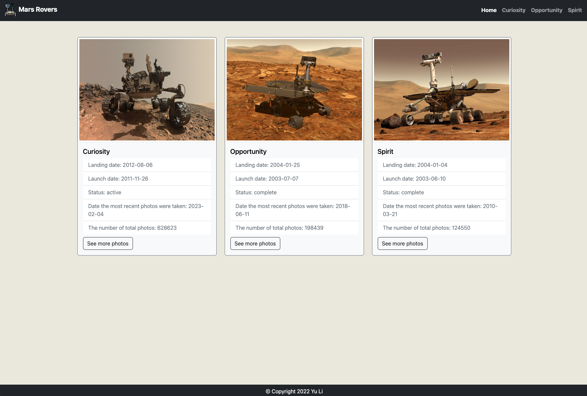
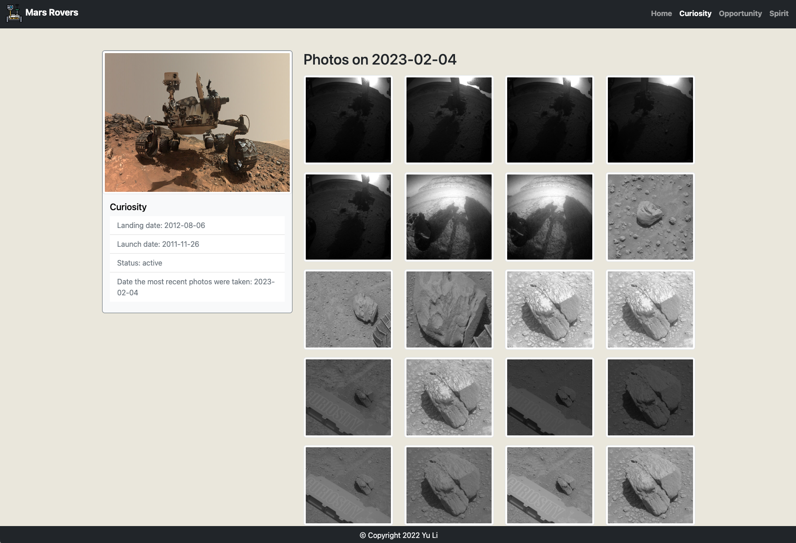

# Project: Mars Dashboard - Functional Programming with JavaScript

## Overview

The project is going to create a Mars rover dashboard that consumes the NASA API. The dashboard will allow the user to select which rover's information they want to view. Once they have selected a rover, they will be able to see the most recent images taken by that rover, as well as important information about the rover and its mission.

### NASA API

The NASA API has a lot more data to offer than what we are using here. There's no extra credit in this course, but it could be fun explore their API and see what they have to offer and what strikes your creativity to add into your project. You are not limited to the API calls we require. Look here (https://api.nasa.gov/ at the Browse API's section) to see all that's available.

Some ideas might be to incorporate the Astronomy Photo of the Day into your design, collect weather information on Mars, etc...

### Purpose
The app will make use of all the functional concepts and practices you have learned in this course, and the goal is that you would become very comfortable using pure functions and iterating over, reshaping, and accessing information from complex API responses.

## Getting Started

1. Run the terminal command: `npm install` and `npm start` 
2. Open the browser and enter the url: `http://127.0.0.1:3000`

## Project Requirements

### Environment Setup

| CRITERIA                              | MEETS SPECIFICATIONS                                         |
| :------------------------------------ | :----------------------------------------------------------- |
| Create a Node and Express Environment | App must use a Node/Express backend. Install the following `npm` packages in order to work with the API and build the rest of the app: -Express -Body parser -Dotenv -ImmutableJS Bolded files/folders are part of the [Backend File](https://video.udacity-data.com/topher/2019/November/5dd48879_rubric-envsetup-backendnodeexpress-ms-2/rubric-envsetup-backendnodeexpress-ms-2.png) structure. |
| Create a Javascript Frontend          | Setup the basic frontend dependencies and file structure for a single page application. Some starter code will be provided. Bolded files/folders are part of the [Frontend File](https://video.udacity-data.com/topher/2019/November/5dd4887a_rubric-envsetup-frontend-ms-2/rubric-envsetup-frontend-ms-2.png) structure. |
| Immutable JS installed                | Set up Immutable js for this project. For this project we are using a script for the CDN version. You should see the script referenced in `index.html`. |

### Functional JS Logic

| CRITERIA                                    | MEETS SPECIFICATIONS                                         |
| :------------------------------------------ | :----------------------------------------------------------- |
| Create API Credentials                      | Set up credentials to connect to the NASA API. -Create an API key through NASA’s API -Add API key to the provided `.env-example` file. -Rename the `.env-example` file to `.env`. **Note**: The `.env-example` file is publicly visible and should not contain any personal information. |
| Show most recent information from the API   | Create a dashboard showing photos and information about the Mars rovers using the NASA API Needs to display a minimum of this information for each rover (there are 3): -Launch Date -Landing Date -Status -Most recently available photos -Date the most recent photos were taken |
| Create Requests for the Desired Information | Set up the Node/Express app as a middleman to take requests from the frontend, make requests to the API, and pass that information back to the frontend using functional methods. |

### Functional JS Logic

| CRITERIA                             | MEETS SPECIFICATIONS                                         |
| :----------------------------------- | :----------------------------------------------------------- |
| Use Pure Functions to organize logic | Build custom pure functions to do logic. No logic should happen outside of these functions. |
| Use of const/let/var correctly       | Use the variable types in the appropriate instance: -`const` for all values that will not change -`let` for those that will need to change -`var` **only** if an instance comes up where a globally editable value is necessary |
| Use of array methods correctly       | Use the correct method to fit the information they are working with from the API. In the logic you should be able to see: -At least one custom pure function using `map`, just about every API call will require this at some point. -At least one dynamic component on their page (for instance, one that uses an `if statement` to behave differently based on the presence or absence of a value). |
| Use higher-order functions           | Use at least **2** higher-order functions that are reusable UI elements (i.e. an unordered list function that is returned by the other dashboard section functions). |

### Dynamic UI

| CRITERIA                                        | MEETS SPECIFICATIONS                                         |
| :---------------------------------------------- | :----------------------------------------------------------- |
| Create an interactive UI                        | The UI should have a dynamic aspect that allows a user to choose which rover’s information they want to see. This will most likely be a set of tabs that can be clicked to see the information. |
| Create appealing page with mobile first styling | Build upon the given mobile first styling for mobile or desktop. Must be a breakpoint for mobile that comes first in the stylesheet. |

## Applied Technics

- HTML, CSS, JS
- EJS
- Bootstrap
- Immutable.js
- Node.js

## Future Plan

- Allow users to select date which rover's images are queried on
- Explore other endpoints of the NASA API such as the following:
  - Incorporate the apod image in the styling.
  - Add the Mars weather embed code.
  - Add a wind graph at the location of the rover.

## Screenshots

